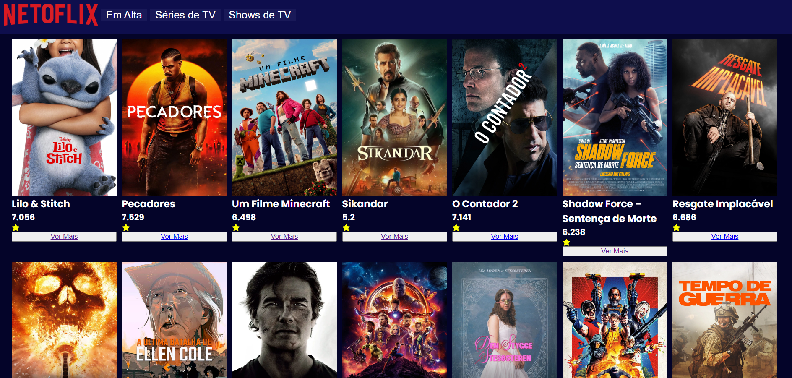
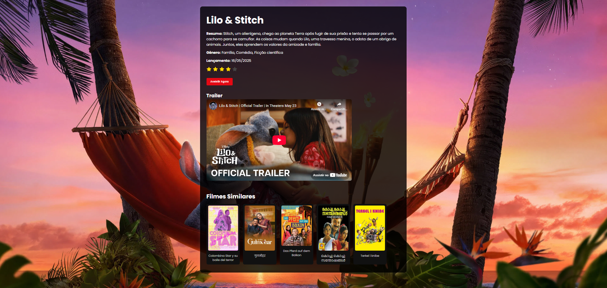

# 🎬 Netoflix

Catálogo de filmes baseado na API [TMDB](https://www.themoviedb.org/), desenvolvido com React + Vite. A aplicação exibe filmes populares, permite acessar uma página detalhada com trailer, sinopse, avaliação e filmes similares.

---

## 🚀 Tecnologias Utilizadas

- [React](https://reactjs.org/)
- [Vite](https://vitejs.dev/)
- [React Router DOM](https://reactrouter.com/)
- [TMDB API](https://developer.themoviedb.org/)
- [React Icons](https://react-icons.github.io/react-icons/)
- CSS e Componentes customizados

---

## 📁 Funcionalidades

### Página principal (home):
- Listagem de filmes populares
- Card de filme com título, imagem e avaliação

### Página de detalhes:
- Imagem de fundo e título do filme
- Gêneros, resumo e data de lançamento
- Nota (com estrelas ★)
- Trailer do YouTube integrado
- Listagem de filmes similares

---

## Contato

mariaclaradamasceno882@gmail.com

